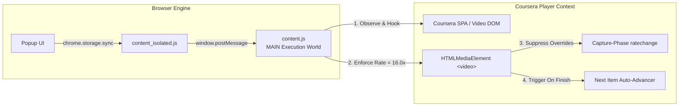

# ⚡ Coursera 16x Turbo Speed & Auto-Advancer

[](https://developer.chrome.com/docs/extensions/mv3/intro/)
[](https://addons.mozilla.org/)
[](LICENSE)
[](manifest.json)

A high-performance, cross-browser WebExtension (**Manifest V3**) compatible with both **Chromium** (Chrome, Brave, Edge, Opera) and **Gecko** (Firefox) engines. It accelerates Coursera video lectures up to **16.0x speed** (defaulting to 16x out of the box), neutralizes platform telemetry rate-resets, and automates course progression across consecutive lectures.

---

## 🌟 Key Features

* **⚡ 16.0x Instant Acceleration**: Automatically sets and maintains 16.0x playback speed on all Coursera video lectures with zero manual configuration.
* **🛡️ Telemetry & Player Rate-Lock Override**: Attaches high-priority capture-phase listeners directly into the host page's V8 context to prevent Coursera's player scripts from resetting the speed back to 1.0x.
* **⏩ Automated Course Progression**: Detects lecture completion and automatically clicks Coursera's **"Next Item"** button to advance to the next lecture seamlessly.
* **🔄 Multi-Video Continuity**: Hooks into SPA navigation (`pushState` / `popstate`) and video track swaps (`loadstart` / `emptied`), ensuring every consecutive lecture is automatically accelerated without toggling the extension on and off.
* **🧩 React DOM Safe & Resilient**: Floating HUD and listeners operate independently of Coursera's React component hierarchy, eliminating React virtual DOM reconciliation errors and video player crashes.
* **🎛️ Clean Minimalist Popup UI**: Adjust speed dynamically from 0.5x to 16.0x with quick presets (1.0x, 2.0x, 5.0x, 10.0x, 16.0x) and toggle auto-advance in real-time.
* **🔒 100% Private & Local**: Zero remote code execution and zero data collection. All operations evaluate strictly on your local machine.

---

## 🚀 Manual Installation Guide (Load Unpacked)

You can easily install and run this extension directly in your browser without downloading it from the web stores.

### 📥 Step 1: Download the Repository

Clone or download this repository to your local computer:

```bash
git clone https://github.com/SpaceCodelab/speed-enhancer.git
```

*(Alternatively, click **Code** ➔ **Download ZIP** on GitHub and extract the folder).*

---

### 🌐 Step 2: Install in Your Browser

#### For Google Chrome / Brave / Microsoft Edge / Chromium / Opera:

1. Open your browser and navigate to the extensions management page:
   * **Chrome / Chromium**: `chrome://extensions/`
   * **Brave**: `brave://extensions/`
   * **Microsoft Edge**: `edge://extensions/`
   * **Opera**: `opera://extensions/`
2. In the top right corner, enable the **Developer mode** toggle switch.
3. Click the **Load unpacked** button (top left).
4. Select the folder containing this repository (the folder containing `manifest.json`).
5. The extension is now installed! Pin it to your toolbar for quick access.

---

#### For Mozilla Firefox:

1. Open Firefox and navigate to:
   ```text
   about:debugging#/runtime/this-firefox
   ```
2. Click the **Load Temporary Add-on...** button.
3. In the file picker, select the [`manifest.json`](manifest.json) file located inside the extension folder.
4. The extension will be loaded and active immediately.

> **Note for Firefox Users:** Temporary add-ons in standard Firefox remain active until the browser restarts. To keep it permanently installed without signing, use Firefox Developer Edition / Nightly or submit the zipped package to addons.mozilla.org (AMO).

---

## 🎮 How to Use

1. Open any lecture video on **[Coursera.org](https://www.coursera.org/)**.
2. The video will automatically begin playing at **16.0x speed** with pitch preservation.
3. A subtle floating badge (**`16.0x Speed`**) will appear in the bottom-right corner to indicate that acceleration is active.
4. When the video reaches the end, it will automatically advance to the next lecture item after a brief, safe delay.
5. Click the extension icon in your browser toolbar to:
   * Pause/Resume turbo acceleration.
   * Adjust target speed via the custom slider or numeric input (0.5x – 16.0x).
   * Choose quick speed presets (`1.0x`, `2.0x`, `5.0x`, `10.0x`, `16.0x`).
   * Toggle the **Auto-Advance Course** feature on/off.

---

## 📁 Project Structure

```text
├── manifest.json            # Cross-browser Manifest V3 (Chrome + Firefox)
├── background.js            # Background service worker & Firefox event script
├── content.js               # Primary MAIN world script (V8 rate enforcement & auto-progression)
├── content_isolated.js      # Isolated world storage bridge for real-time sync
├── popup.html               # Minimalist dark glassmorphic popup UI
├── popup.css                # Popup styling and animations
├── popup.js                 # Settings synchronization & chrome.storage.sync persistence
└── icons/                   # Extension icons
    ├── icon16.png
    ├── icon48.png
    └── icon128.png
```

---

## 🛠️ How It Works Under the Hood



1. **MAIN Execution World Injection**: Evaluates directly in the page's V8 context to manipulate `HTMLMediaElement` properties across top-level and nested iframe players.
2. **Capture-Phase Rate Shielding**: `addEventListener('ratechange', ..., true)` catches Coursera telemetry resets in the capture phase before host scripts can downgrade playback speed.
3. **Audio Decoder Protection**: Dynamically applies `preservesPitch`, `webkitPreservesPitch`, and `mozPreservesPitch` to avoid hardware buffer underruns at extreme multipliers.
4. **Resilient SPA Watchdog**: A lightweight 600ms watchdog loop continuously latches onto newly transitioned or dynamic videos without requiring manual toggling.

---

## 📦 Building the Store Package (.zip)

To generate a clean `.zip` archive ready for upload to the **Chrome Web Store** or **Mozilla Add-ons (AMO)**:

```bash
python3 -c "
import zipfile, os
files = ['manifest.json', 'background.js', 'content.js', 'content_isolated.js', 'popup.html', 'popup.css', 'popup.js', 'icons/icon16.png', 'icons/icon48.png', 'icons/icon128.png']
with zipfile.ZipFile('oju_speed_enhancer.zip', 'w', zipfile.ZIP_DEFLATED) as zf:
    for f in files: zf.write(f)
print('Package built successfully: oju_speed_enhancer.zip')
"
```

---

## 📄 License

This project is licensed under the [MIT License](LICENSE).
